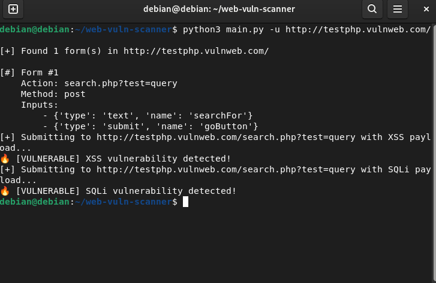

# 🔍 web-vuln-scanner

A template-driven web vulnerability scanner — currently a simple Python CLI that detects HTML forms and tests for **XSS** and **SQL Injection**. Planned architecture: a high-performance Go request core (`wvs-core`) + a Python orchestration layer (`pywvs`) for templates, matchers and reporting.



---

## 🚀 One-line summary
Template-driven web vulnerability scanner — form discovery + payload injection for quick XSS/SQLi checks, JSON/HTML reporting.

---

## ⚙️ Quickstart

### Prerequisites
- Python 3.11+ (recommended)
- Docker (optional, for containerized runs)

### Local (developer)
```bash
git clone https://github.com/alishams11/web-vuln-scanner.git
cd web-vuln-scanner

# create & activate venv (recommended)
python3 -m venv .venv
source .venv/bin/activate

# install dependencies
pip install -r requirements.txt
```

### Docker (if Dockerfile present)
```bash
# build the image (multi-stage Dockerfile expected)
docker build -t web-vuln-scanner:dev .

# example run (mount outputs to persist results)
docker run --rm -v "$(pwd)/outputs:/app/outputs" web-vuln-scanner:dev scan --target http://localhost:8080 --template templates/xss.yaml --output /app/outputs/report.json
```

---

## 🕹️ Usage (CLI)

**Basic (current Python CLI):**
```bash
python3 main.py -u http://target.com
```

**Example (with options):**
```bash
python3 main.py --url http://testphp.vulnweb.com/ --concurrency 10 --timeout 10 --output outputs/results.json
```

> Future: unified CLI `wvs scan ...` will call the Go core and run template-driven modules.

---

## 📝 Sample Output (JSON)
Saved to `outputs/results.json` (example entries):

```json
[
  {
    "timestamp": "2025-06-17 12:52:49",
    "vulnerability": "XSS",
    "target": "http://testphp.vulnweb.com/",
    "path": "/vulnerabilities/xss_r/",
    "payload": "<script>alert('XSS')</script>",
    "evidence": "<script>alert('XSS')</script>",
    "confidence": 0.80
  },
  {
    "timestamp": "2025-06-17 12:52:58",
    "vulnerability": "SQLi (error-based)",
    "target": "http://testphp.vulnweb.com/",
    "path": "/vulnerabilities/sqli/",
    "payload": "' OR 1=1 -- ",
    "evidence": "SQL syntax error: unclosed quotation mark",
    "confidence": 0.65
  }
]
```

---

## 📁 Output location
All scan outputs (JSON, HTML reports, screenshots) are stored under the project `outputs/` directory by default:

```
outputs/
  ├─ results.json
  ├─ report.html
  └─ screenshots/
```

---

## ✅ Features (current & planned)

**Current**
- Detects HTML forms on a page and extracts `method`, `action`, and inputs.
- Injects basic XSS/SQLi payloads and looks for reflected payloads / error indicators.
- Saves findings as JSON with timestamps.

**Planned (30-day roadmap)**
- Split to two-tier architecture: Go core (`wvs-core`) for concurrent requests and Python wrapper (`pywvs`) for templates + reporting.
- Template-driven checks (YAML) and a marketplace of templates.
- Modules: XSS (reflected/stored), SQLi (error/blind), LFI, SSRF, auth/session handling.
- HTML reports (Jinja2), JSON lines exporter for ELK, CI + tests, Docker multi-stage image.

---

## 📸 Screenshot
Include `screenshots/cli_demo.png` (or demo GIF) showing an example run.

---

## 🧭 How to help / contribute
- Add new templates under `templates/` (YAML format).
- Move scanner logic from `main.py` into `pywvs/` package (see roadmap).
- Add unit/integration tests under `tests/` (use pytest + fixtures).

See `CONTRIBUTING.md` for coding style and PR guidance.

---

## 📝 License
MIT — see `LICENSE`.

---
